# Soteria - Dashboards

### (Document WIP)

Dashboards is essential since it is the single place where the people at CxO/ Admin level can view the various reports of the data collected by other modules. Also it gives the Module Admins to configure components specific to their module.

## Application Links

Table of links to each of the application environments.  
Also see domain listing here: [https://github.dxc.com/soteria/domains](https://github.dxc.com/soteria/domains)

| Environment | URL                                                          |
| ----------- | ------------------------------------------------------------ |
| Sandbox     | [https://xxx.example.com/dashboards/](https://xxx.example.com/dashboards/) |
| Development | [https://example.net/dashboards/](https://example.net/dashboards/)         |
| Staging     | [https://example.org/dashboards/](https://example.org/dashboards/)         |
| Production  | [https://example.com/dashboards/](https://example.com/dashboards/)         |

## Roles/ Groups

List of Roles/ groups that are available as part of the dashboards.

| Role/Group | Permission                                   |
| ---------- | -----------------------------------------    |
| Root       | Will have access to all the menus            |
| Admin      | All menus execept the User Permission Screen |
| (User)     | Access to Documents in Readonly mode         |

## Registration & Login

- First time users will be asked for their email id, post which they can login with the registered emailID & followed by the OTP, that will be sent to the mentioned email id.   
  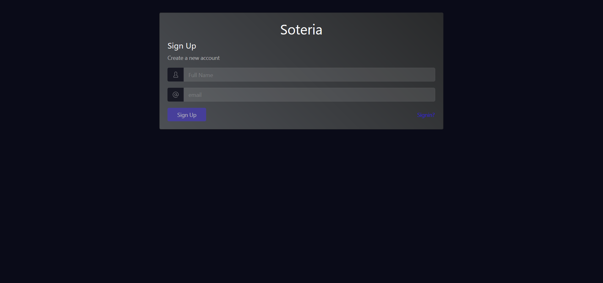

- Login   
  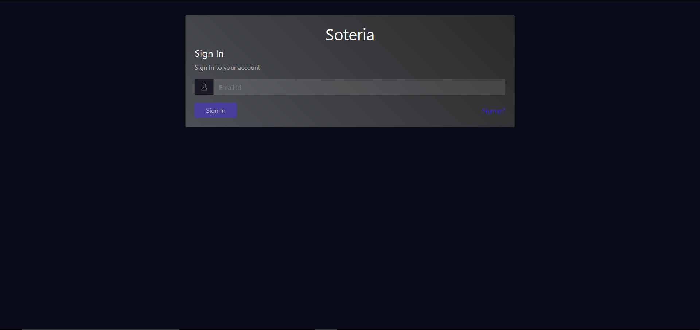
  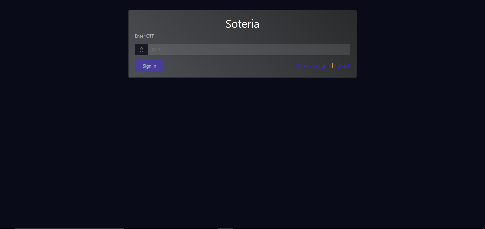
  
- When the Application is deployed for the first time, its mandatory to assign atleast one registered user under the Root group on Cognito via the AWS Console.

- By default, all registered employees will just have the default user role. To get elevated to other roles, users with Root Access/ Group, can modify the roles/ groups of others using the User Permission Screen. 

### User:

- On successful registration, the user by default will have the minimal access to the 'Documentation' menu with 'read only access'.

  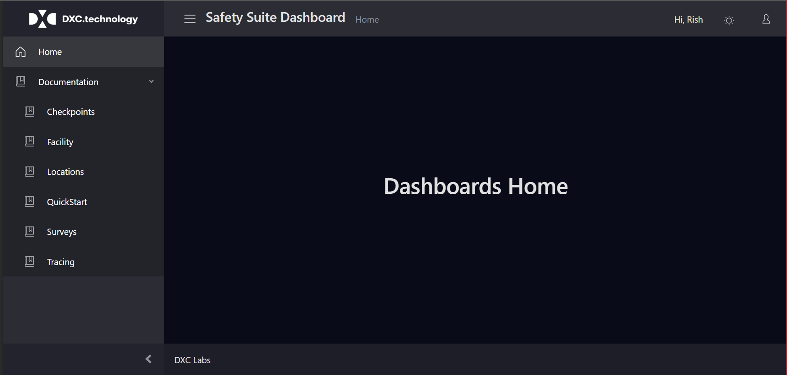

### Admin:

- On getting elevated to the 'Admins group', the user can access the 'Reports, Configuration & Documentation' menus on the Dashboard with the Write permission.

 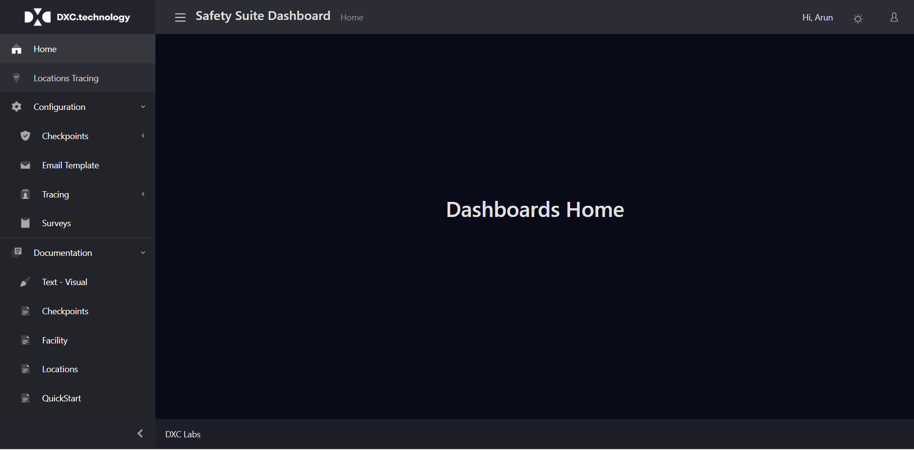
    
### Root:

- On getting elevated to the 'Root group', the user can access the 'User Permission, Reports, Configuration & Documentation' menus on the Dashboard with the Write permission..

  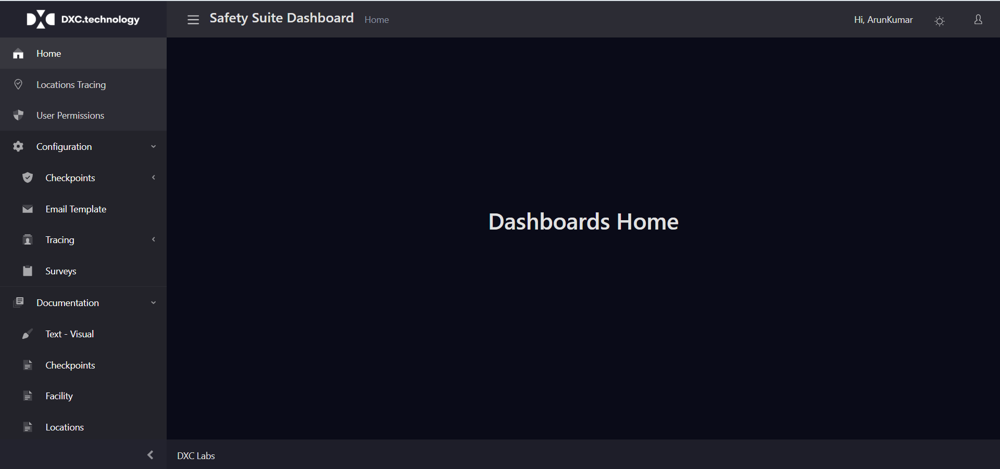

## Dashboards Component

### User Permission
- Those who have "root" access can Edit the Cognito groups associated with an user, as well as remove the user from the Cognito.   
a. Go to Dashboard -->User Permissions->Filter the user--> Click the eye icon--> Select the role from the dropdown --> add(+) or delete(-)  
b. Go to Dashboard -->User Permissions->Filter the user-->Click the Trash Icon (To Remove User)

  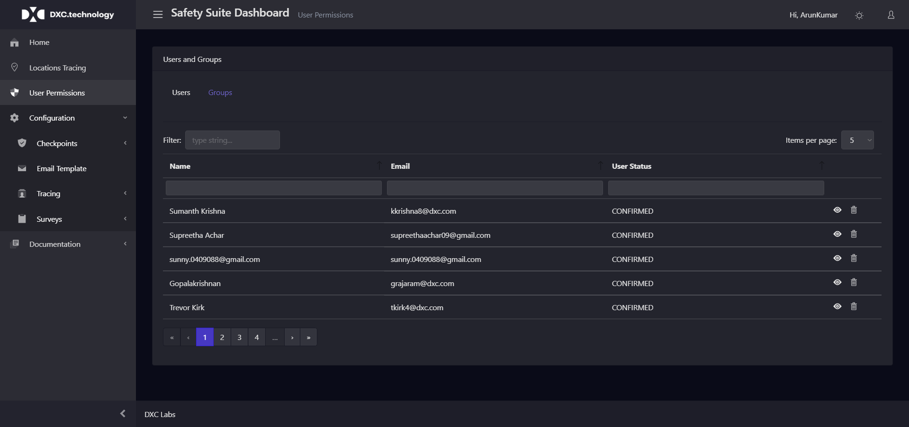
  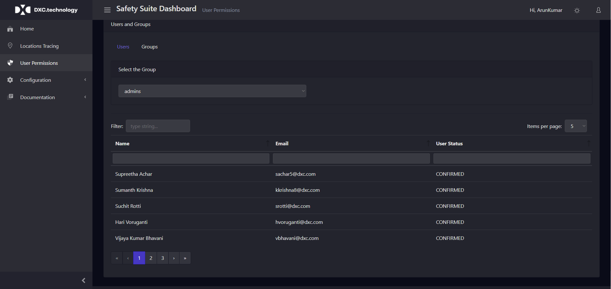

### Email Template
- Those who have "root"/ "admin" access can Create/ Update the Email Templates & send the email Notification leveraging the created template.
- Attachment option is available only for the templates with static content & not available for the dynamic content.

  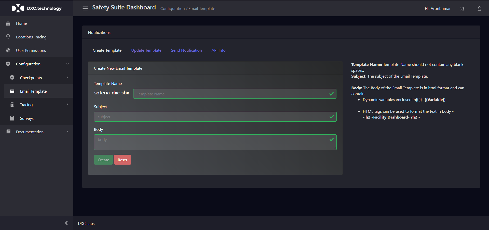
  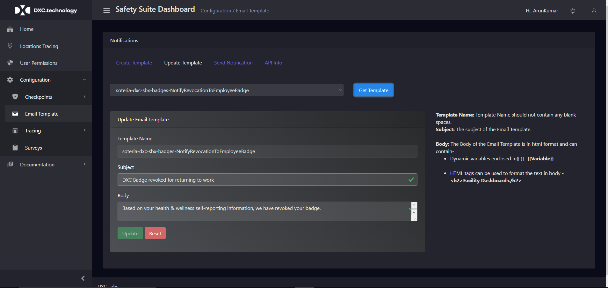
  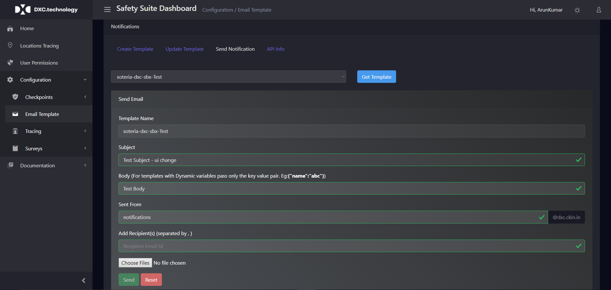
     
## Technology

| Component          | Technology                    | Description         |
| ---------------- | ----------------------------- | ------------------- |
| Web UI           | React, CoreUI, CloudFront     | Progressive Web App |
| Authentication & Authorization   | AWS Cognito   |                     |
| API              | AWS Gateway                   | Open API Spec       |
| Business Logic   | NodeJS                        | AWS Lambda          |
| Coded Deployment | Cloud Formation               |					 |
